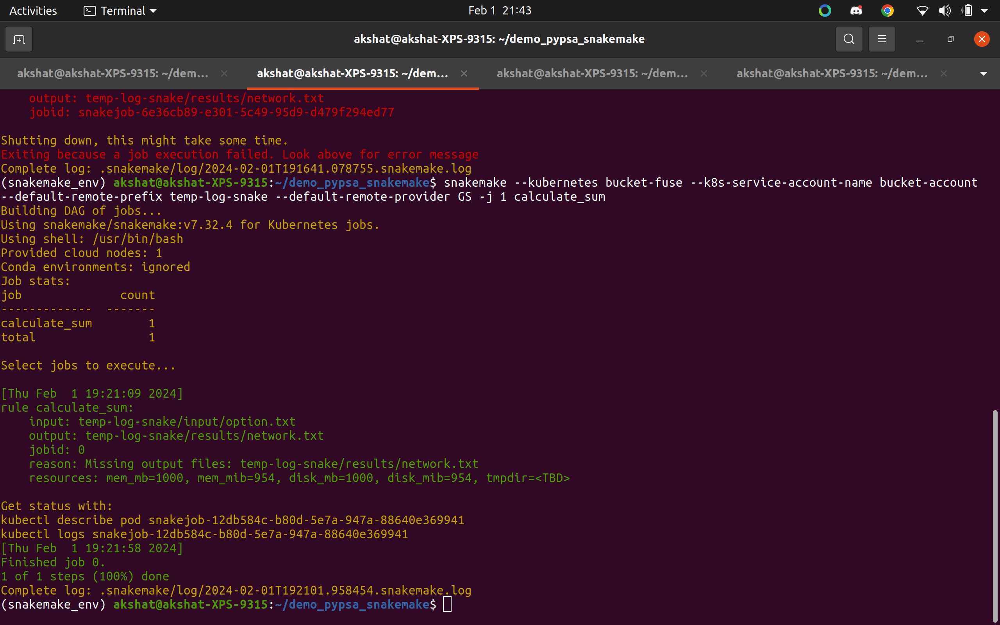
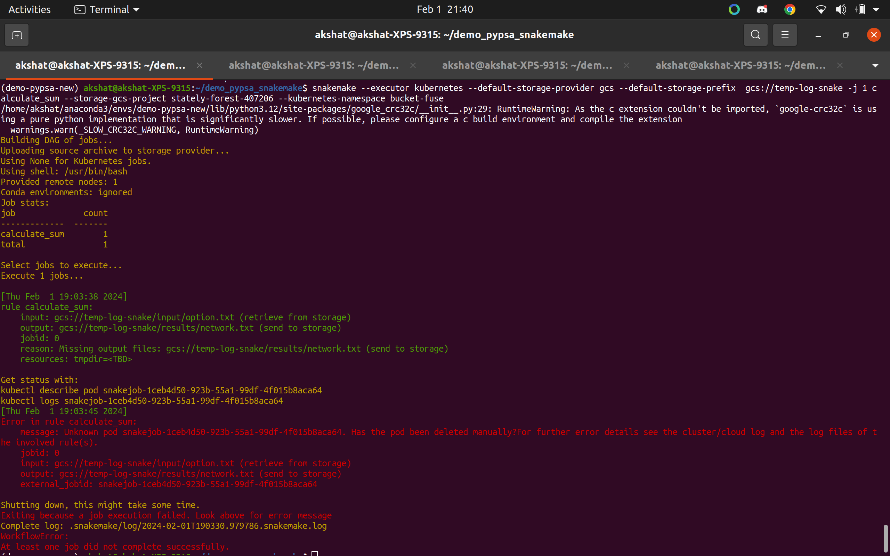
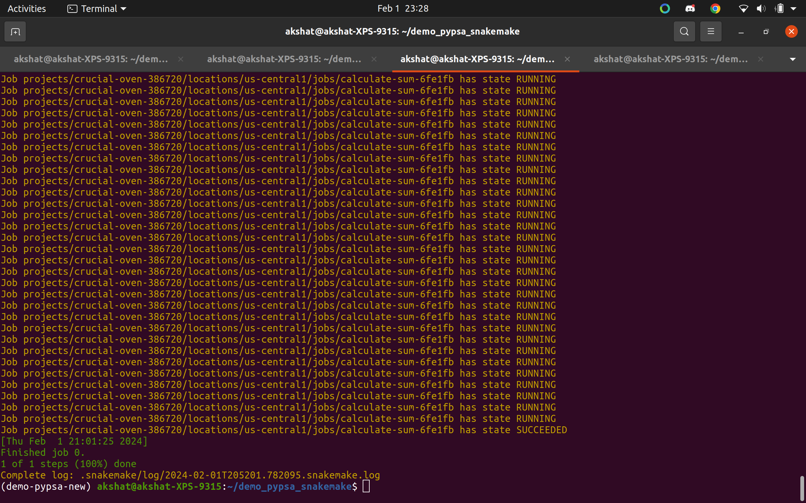
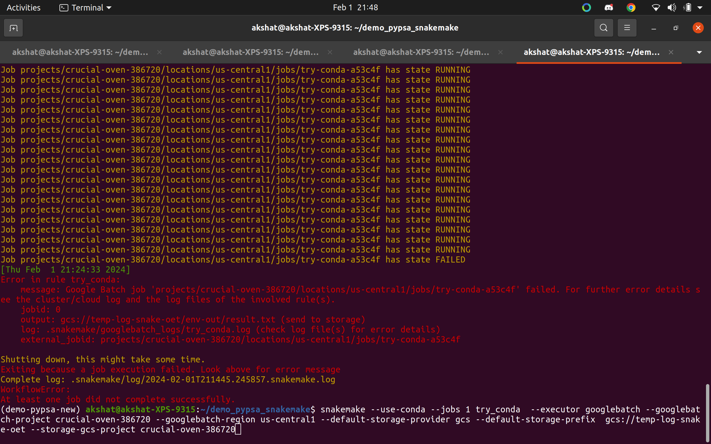

# Using Snakemake as a Kubernetes Executor

- Based on these test we have to determine if snakemake satisfies our usecase as a cloud orchestration tool .
- Note: Snakemake has an [open issue](https://github.com/snakemake/snakemake/issues/1801) regarding Gurobi licenses.
- what are we building so we can decide which approch to take???

## Background

### Snakemake Version History

- **Version 7.32.3:** Snakemake operated as a monorepo, combining orchestration and Kubernetes execution within a single repository.
  - Documentation: [Snakemake 7.32.3](https://snakemake.readthedocs.io/en/v7.32.3/index.html)

- **Latest Version:** Introduction of a plugin system, separating Kubernetes, Google Batch, and other functionalities into distinct repositories.
  - Documentation: [Latest Snakemake Docs](https://snakemake.readthedocs.io/en/stable/)
  - Plugin Catalog: [Snakemake Plugin Catalog](https://snakemake.github.io/snakemake-plugin-catalog/index.html)

## Evaluating Snakemake for Cloud Execution

### Upsides

- Existing developers can execute rules in the cloud by adding tags to commands without additional code.
- The Kubernetes package in Snakemake reuses some executor code, enhancing familiarity.

### Downsides

- Persistent Volume Claims are under development. See [PR#9](https://github.com/snakemake/snakemake-executor-plugin-kubernetes/pull/9).
- Limited control over pods and jobs executed on the cluster.
- High development time due to sparse documentation.

## Version Comparisons

### Snakemake 7.32.3

- **Execution Status:** ✅ Successful
- **Guide:** [Snakemake on Azure AKS](https://snakemake.readthedocs.io/en/v7.32.3/executor_tutorial/azure_aks.html)
- **Steps:**
  1. Create a service account with permissions specified in the guide.
  2. Download the service account key and add it to the root folder as `key.json`.
  3. Create a bucket and upload the input folder.
  4. Execute the command:
     ``
     snakemake --kubernetes --default-remote-prefix bucket-name --default-remote-provider GS -j 1 calculate_sum
     ``
  5. Results are stored in the specified bucket.
- **Execution Outcome:** 

### Snakemake 8.4.1

#### Kubernetes Execution

- Command: `snakemake --executor kubernetes --default-storage-provider gcs --default-storage-prefix gcs://bucket-name -j 1 calculate_sum --storage-gcs-project stately-forest-407206 --kubernetes-namespace bucket-fuse`
- Issue: Error stating "Has the pod been deleted manually."
- Execution Status: 

#### Google Batch Execution

- Successful Execution (without Conda):
- `snakemake --jobs 1 calculate_sum --executor googlebatch --googlebatch-project crucial-oven-386720 --googlebatch-region us-central1 --default-storage-provider gcs --default-storage-prefix gcs://temp-log-snake-oet --storage-gcs-project crucial-oven-386720`
- **Execution Outcome:** 
  
- Unsuccessful Execution (with Conda):
- `snakemake --use-conda --jobs 1 try_conda --executor googlebatch --googlebatch-project crucial-oven-386720 --googlebatch-region us-central1 --default-storage-provider gcs --default-storage-prefix gcs://temp-log-snake-oet --storage-gcs-project crucial-oven-386720`
- Execution Status: 
